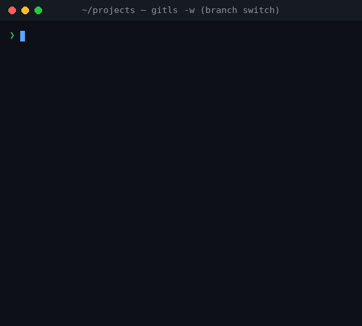

# gitls

[](https://github.com/sven42xyz/gitools/actions/workflows/ci.yml)

**A fast, minimal CLI to inspect and act on many git repositories at once — with a live watch mode.**



<sub>*Watch mode: a live status table you can drive — here switching a branch across every clean repo.*</sub>

## Contents

- [Why gitls](#why-gitls)
- [Install](#install)
- [Quick start](#quick-start)
- [Watch mode](#watch-mode) ⭐
- [The status table](#the-status-table)
- [Filtering](#filtering)
- [Acting on all repos](#acting-on-all-repos)
- [Configuration](#configuration)
- [Reference](#reference)
- [License](#license)

## Why gitls

When you keep a folder full of repositories — work projects, microservices,
dotfiles — `gitls` scans them **in parallel** and shows the branch, sync state,
working-tree status and last-commit time of every one in a single table. From
there you can **fetch**, **pull** or **switch branches** across all of them at
once, and a live **[watch mode](#watch-mode)** keeps the table on screen and
lets you trigger those actions interactively.

- 🔭 **Watch mode** — live, in-place refreshing table with interactive keys
- 🔀 **Branch switching** across all clean repos in one command
- ⬇️ **Fetch** / **pull** (fast-forward) every repo from its `origin`
- 🩹 **Dirty filter** — show only the repos that need attention
- 🧭 Branch, ahead/behind, staged/modified/untracked counts, relative commit time
- ⚡ Parallel recursive scan; skips `vendor/`, `node_modules/`, `.git/` automatically
- ⚙️ Config file `~/.gitlsrc` for persistent defaults
- 🎨 Colour output (disable with `--no-color`)

## Install

### Homebrew (macOS / Linux)

```sh
brew tap sven42xyz/tap
brew install gitls
```

### Build from source

Requires [libgit2](https://libgit2.org/) ≥ 1.7 (and [git](https://git-scm.com/)
for the `fetch` / `pull` subcommands).

```sh
# macOS
brew install libgit2

# Debian / Ubuntu
sudo apt install libgit2-dev

# Fedora / RHEL
sudo dnf install libgit2-devel

git clone https://github.com/sven42xyz/gitools.git
cd gitools
make
sudo make install        # installs to /usr/local/bin
```

## Quick start

```sh
gitls                   # status table for repos under the current directory
gitls ~/projects        # ... under a specific directory
gitls -w ~/projects     # live watch mode (press q to quit)
gitls --dirty           # only repos that aren't clean and in sync
gitls -s main ~/projects   # switch every clean repo to main
gitls pull ~/projects   # fast-forward pull every clean repo
```

## Watch mode

`gitls -w` keeps the status table on screen and refreshes it **in place** at a
fixed interval (3 seconds by default), on the terminal's alternate screen so
your scrollback is left untouched. It's great for keeping an eye on a tree of
repos in a side window while you work.

```sh
gitls -w            # refresh every 3 seconds
gitls -w 10         # refresh every 10 seconds
gitls -w --dirty    # only show repos that need attention, live
```

```text
Scanned: /home/me/projects

  NAME            BRANCH     SYNC  WHEN         STATUS
  ──────────────────────────────────────────────────────
  api-server      main       ↓2    3 min ago    ✓
  frontend        main       ≡     12 min ago   ✗1
  auth-service    feature-x  ↑1    1 hour ago   ●2

  3 repos · 1 clean · 1 dirty · 1 behind

  f fetch · p pull · s switch · r refresh · q quit
  interval 3s · /home/me/projects · switched to main
```

### Interactive keys

You can act on the whole tree without leaving the view. The action runs against
every repo, the table refreshes immediately to show the result, and the footer
notes the last action performed.

| Key | Action |
|-----|--------|
| `f` | Fetch all repos from `origin` |
| `p` | Fast-forward pull all clean repos |
| `s` | Open the branch picker, then switch all clean repos to the chosen branch |
| `r` | Refresh now (don't wait for the interval) |
| `q` / Ctrl-C | Quit |

These are the same operations as the [`fetch` / `pull` / `-s`
commands](#acting-on-all-repos) — including creating a local tracking branch
when switching to a branch that only exists on `origin`. While an action runs, a
spinner animates the verb and the table stays on screen until the new one is
ready.

### Branch picker

Pressing `s` opens an interactive picker listing the **recently active
branches** across all scanned repos, most recent first, drawn in place below the
table:

```text
  ... status table ...

  f fetch · p pull · s switch · r refresh · q quit
  interval 3s · /home/me/projects

  switch all clean repos to: dev▏
  ↑/↓ navigate · Tab/Enter select · Esc cancel
  ❱ develop
    hotfix
```

- Type to **filter** the list; **↑/↓** move the selection.
- **Tab** or **Enter** choose the highlighted branch (Enter also accepts a typed
  name that matches nothing, e.g. to create a new local tracking branch).
- **Backspace** edits, **Esc** / Ctrl-C cancels.

### Notes

- No `ncurses` dependency — only raw ANSI escapes and `termios`.
- The terminal is always restored on exit, including on `SIGINT` / `SIGTERM`:
  the alternate screen is left, the cursor shown again and terminal settings reset.
- Reuses the same parallel scan as the one-shot mode, so refreshes are fast.
- Requires an interactive terminal (stdin and stdout); piped output is rejected.
- The `f` / `p` keys need the `git` binary, as for the subcommands.

> **Note:** `r` and the automatic refresh only re-scan **locally** — they don't
> fetch. The SYNC column reflects the last fetched state of `origin`; press `f`
> to pick up new remote commits.

## The status table

Every row describes one repository:

```text
  NAME          BRANCH  SYNC  WHEN         STATUS
  api-server    main    ↓2    3 min ago    ✗1
```

| Column | Meaning |
|--------|---------|
| `NAME` | Repository directory name |
| `BRANCH` | Current branch (a detached HEAD shows the short SHA in parentheses) |
| `SYNC` | Relationship to the upstream branch (see below) |
| `WHEN` | Relative time of the last commit |
| `STATUS` | Working-tree state (see below) |

| Symbol | Meaning |
|--------|---------|
| `✓`    | Clean |
| `●N`   | N staged files |
| `✗N`   | N modified (unstaged) files |
| `?N`   | N untracked files |
| `↑N`   | N commits ahead of remote |
| `↓N`   | N commits behind remote |
| `↑N↓M` | Diverged |
| `≡`    | In sync with remote |
| `?`    | No remote configured |

The summary line under the table totals the repos: `N repos · N clean · N dirty`
(plus `N behind` when any are behind).

## Filtering

`--dirty` lists only the repos that are **not** both clean and in sync — anything
with staged, modified or untracked files, commits ahead/behind the remote, a
diverged branch, or a detached `HEAD`. Clean, in-sync repos are hidden.

```text
gitls --dirty ~/projects

  NAME            BRANCH     SYNC  WHEN         STATUS
  ──────────────────────────────────────────────────────
  frontend        main       ↓2    12 min ago   ✗1
  auth-service    feature-x  ↑1    1 hour ago   ●2

  9 repos · 6 clean · 3 dirty · 1 behind (7 hidden)
```

The summary line still reflects **all** scanned repos and appends `(N hidden)` so
the totals stay honest. The filter works in one-shot mode and under `-w`.

Set `dirty_only=true` in the [config](#configuration) to make it the default;
pass `--no-dirty` to show everything for a single run.

## Acting on all repos

### Switch branches (`-s`)

`-s <branch>` switches all clean repositories to a target branch in one command.

```text
gitls -s main ~/projects

Switched to branch: main

  api-server        ✓ switched
  frontend          · already on branch
  auth-service      ✓ switched
  legacy-app        ✗ skipped  2 staged, 1 modified
  infra             · branch not found

  switched 2 · already 1 · skipped 1 dirty
```

- A repo is switched only if it has **no staged or modified files** (untracked
  files are left untouched).
- If the target branch doesn't exist in a repo, it is silently skipped.
- After switching, the full status table is shown for all repos.

By default only switched repos and errors are shown per line; add `-v` to also
see repos already on the branch or where it wasn't found.

#### Fetch and switch

Combine `fetch` with `-s` to switch to a branch that only exists on the remote.
gitls fetches first, then switches — creating a local tracking branch
automatically if the branch isn't present locally yet.

```text
gitls fetch -s feature-x ~/projects

Switched to branch: feature-x

  api-server        ✓ created & switched
  frontend          ✓ switched
  auth-service      · branch not found
  legacy-app        ✗ skipped  1 modified

  switched 1 · created 1 · skipped 1 dirty
```

| Result | Meaning |
|--------|---------|
| `✓ switched` | Branch existed locally, checked out |
| `✓ created & switched` | Local tracking branch created from `origin/<branch>`, checked out |
| `· already on branch` | Already on that branch |
| `· branch not found` | Branch doesn't exist locally or on `origin` |
| `✗ skipped` | Repo has staged or modified files |

### Fetch

`gitls fetch` fetches all repos from their `origin` remote and shows the updated
ahead/behind status. By default only fetched repos and errors are shown per line;
add `-v` to see up-to-date and no-remote ones too.

```text
gitls fetch ~/projects

Fetch results:

  api-server    ✓ fetched
  frontend      ✓ fetched
  auth-service  · no remote
  legacy-app    ✓ fetched

  fetched 3 · up to date 0 · no remote 1
```

### Pull

`gitls pull` fast-forward-pulls all clean repos. Dirty repos are skipped and
diverged repos are flagged.

```text
gitls pull ~/projects

Pull results:

  api-server    ✓ pulled
  frontend      · up to date
  auth-service  · no remote
  legacy-app    ✗ skipped  (dirty)
  infra         · not fast-forward

  pulled 1 · up to date 1 · skipped 1 dirty · not fast-forward 1
```

- A repo is pulled only if it has **no staged or modified files**.
- Only fast-forward merges are performed — diverged repos are reported, never
  force-merged.
- Repos without a remote are listed but skipped.

## Configuration

Copy the bundled example to get started:

```sh
cp /usr/local/share/doc/gitls/gitlsrc.example ~/.gitlsrc
```

Or create `~/.gitlsrc` manually:

```ini
# ~/.gitlsrc
default_dir=~/projects
max_depth=3
skip_dirs=build,dist,tmp,*.egg-info
watch_interval=5
dirty_only=false
no_color=false
```

| Key | Description | Default |
|-----|-------------|---------|
| `default_dir` | Directory to scan when none is given on the CLI | `.` (current dir) |
| `max_depth` | Maximum directory recursion depth | `5` |
| `skip_dirs` | Comma-separated directory names to skip (glob patterns supported) | — |
| `watch_interval` | Default refresh interval (seconds) for `-w` | `3` |
| `dirty_only` | `true`/`1` to filter to dirty repos by default (override per-run with `--no-dirty`) | `false` |
| `no_color` | `true`/`1` to disable colours | `false` |

CLI flags always override the config file. Passing an explicit directory
(including `.`) always overrides `default_dir`:

```sh
gitls .          # scan current directory, ignoring default_dir
gitls ~/other    # scan a specific directory
```

Set `GITLS_CONFIG=/path/to/file` to use a different config path.

## Reference

```text
gitls [fetch|pull] [OPTIONS] [DIRECTORY]

Subcommands:
  fetch            Fetch all repos from their remote
  pull             Fast-forward pull all clean repos

Options:
  -s <branch>      Switch all clean repos to <branch> if it exists
  -d <n>           Max search depth (default: 5)
  -w, --watch [n]  Watch mode: refresh the table every n seconds (default: 3)
  --dirty          Only list repos that are not both clean and in sync
  --no-dirty       Show all repos (overrides dirty_only from the config)
  -a               Include hidden directories
  -v               Verbose: show all repos in summaries, not just changed ones
  --no-color       Disable ANSI colours
  --version        Show version
  -h, --help       Show this help
```

A `gitls(1)` man page is installed alongside the binary — run `man gitls` for
the full reference.

**Requirements:** [libgit2](https://libgit2.org/) ≥ 1.7, and
[git](https://git-scm.com/) for the `fetch` / `pull` subcommands (and the `f` /
`p` keys in watch mode).

## License

MIT — see [LICENSE](LICENSE)
