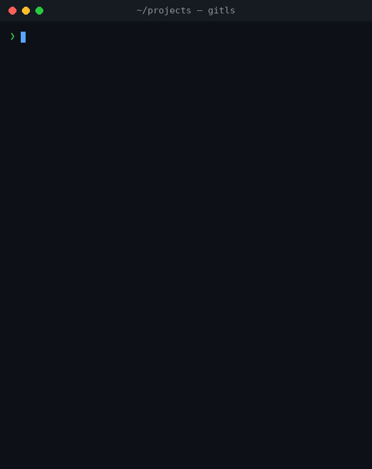

# gitls

[](https://github.com/sven42xyz/gitools/actions/workflows/ci.yml)

A fast, minimal tool to inspect and act on multiple git repositories.




## Features

- **Fetch** all repos from their remote (`fetch`)
- **Pull** (fast-forward only) all clean repos (`pull`)
- **Branch switching** across all clean repos (`-s`)
- **Watch mode** — live, in-place refreshing status table (`-w`)
- **Dirty filter** — show only repos needing attention (`--dirty`)
- Recursive directory scan with configurable depth
- Branch name (incl. detached HEAD as short SHA)
- Staged / modified / untracked file counts
- Ahead / behind upstream
- Relative last-commit time
- Color output (disable with `--no-color`)
- Skips `vendor/`, `node_modules/`, `.git/` internals automatically
- Config file `~/.gitlsrc` for persistent defaults
- Parallel repo processing for fast scans

## Requirements

- [libgit2](https://libgit2.org/) >= v1.9
- [git](https://git-scm.com/) (required for `fetch` and `pull` subcommands)

## Installation

### Homebrew (macOS / Linux)

```sh
brew tap sven42xyz/tap
brew install gitls
```

### Build from source

```sh
# macOS
brew install libgit2

# Debian / Ubuntu
sudo apt install libgit2-dev

# Fedora / RHEL
sudo dnf install libgit2-devel

git clone https://github.com/sven42xyz/gitools.git
cd gitools
make
sudo make install        # installs to /usr/local/bin
```

## Usage

```
gitls [fetch|pull] [OPTIONS] [DIRECTORY]

Subcommands:
  fetch        Fetch all repos from their remote
  pull         Fast-forward pull all clean repos

Options:
  -s <branch>  Switch all clean repos to <branch> if it exists
  -d <n>       Max search depth (default: 5)
  -w [n]       Watch mode: refresh the table every n seconds (default: 3)
  --dirty      Only list repos that are not clean and in sync
  -a           Include hidden directories
  -v           Verbose: show all repos in summaries, not just changed ones
  --no-color   Disable ANSI colours
  --version    Show version
  -h, --help   Show this help
```

### Examples

```sh
# Scan current directory
gitls

# Scan ~/projects, max 3 levels deep
gitls -d 3 ~/projects

# Fetch all repos
gitls fetch ~/projects

# Pull (fast-forward) all clean repos
gitls pull ~/projects

# Watch ~/projects, refreshing every 3 seconds
gitls -w ~/projects

# Watch with a 10-second interval, only showing repos that need attention
gitls -w 10 --dirty ~/projects

# Show only repos that are not clean and in sync
gitls --dirty ~/projects

# Switch all clean repos to main
gitls -s main ~/projects

# Fetch and switch to a branch (creates local tracking branch if needed)
gitls fetch -s feature-branch ~/projects

# No colours (useful for scripts)
gitls --no-color ~/projects
```

## Fetch

`gitls fetch` fetches all repos from their `origin` remote and shows the updated ahead/behind status. By default, only fetched repos and errors are shown per line. Add `-v` to see all repos including up-to-date and no-remote ones.

```
gitls fetch ~/projects

Fetch results:

  api-server    ✓ fetched
  frontend      ✓ fetched
  auth-service  · no remote
  legacy-app    ✓ fetched

  fetched 3 · up to date 0 · no remote 1
```

## Pull

`gitls pull` fast-forward-pulls all clean repos. Dirty repos are skipped; diverged repos are flagged.

```
gitls pull ~/projects

Pull results:

  api-server    ✓ pulled
  frontend      · up to date
  auth-service  · no remote
  legacy-app    ✗ skipped  (dirty)
  infra         · not fast-forward

  pulled 1 · up to date 1 · skipped 1 dirty · not fast-forward 1
```

**Rules:**
- A repo is pulled only if it has **no staged or modified files**
- Only fast-forward merges are performed — diverged repos are reported, never force-merged
- Repos without a remote are listed but skipped

By default, only pulled repos and errors are shown per line. Add `-v` to see all repos including up-to-date and no-remote ones.

## Watch mode

`gitls -w` keeps the status table on screen and refreshes it in place at a
fixed interval (3 seconds by default). It is handy for keeping an eye on a tree
of repos while you work in another window.

```sh
gitls -w            # refresh every 3 seconds
gitls -w 10         # refresh every 10 seconds
gitls -w --dirty    # only show repos that need attention, live
```

```
Scanned: /home/me/projects

  NAME            BRANCH     SYNC  WHEN         STATUS
  ──────────────────────────────────────────────────────
  api-server      main       ↓2    3 min ago    ✓
  frontend        main       ≡     12 min ago   ✗1
  auth-service    feature-x  ↑1    1 hour ago   ●2

  3 repos · 1 clean · 1 dirty · 1 behind

  f fetch · p pull · s switch · r refresh · q quit
  interval 3s · last scan 14:23:01 · switched to main
```

While watching you can act on every repo without leaving the view:

| Key | Action |
|-----|--------|
| `f` | Fetch all repos from `origin` |
| `p` | Fast-forward pull all clean repos |
| `s` | Open the branch picker, then switch all clean repos to the chosen branch |
| `r` | Refresh now (don't wait for the interval) |
| `q` / Ctrl-C | Quit |

The action runs against the whole tree, the table refreshes immediately to show
the result, and the footer notes the last action performed. These are the same
operations as the `fetch` / `pull` / `-s` commands — including creating a local
tracking branch when switching to a branch that only exists on `origin`.

Pressing `s` opens an interactive picker listing the **recently active
branches** across all scanned repos, most recent first:

```
  Switch all clean repos to a branch

  branch: dev▏
  ↑/↓ navigate · Tab/Enter select · Esc cancel

  ❱ develop
    hotfix
```

- Type to filter the list; **↑/↓** move the selection.
- **Tab** or **Enter** choose the highlighted branch (Enter also accepts a
  typed name that matches nothing, e.g. to create a new local tracking branch).
- **Backspace** edits, **Esc** / Ctrl-C cancels.

- Uses the **alternate screen buffer**, so your scrollback is left untouched —
  the table is redrawn in place rather than scrolling past.
- The terminal is always restored on exit, including on `SIGINT` / `SIGTERM`:
  the alternate screen is left, the cursor is shown again and terminal settings
  are reset.
- No `ncurses` dependency — only raw ANSI escapes and `termios`.
- Reuses the same parallel scan as the one-shot mode, so refreshes are fast.
- Requires an interactive terminal; piping the output is rejected.
- The `fetch` and `pull` keys need the `git` binary (as for the subcommands).

## Dirty filter

`--dirty` lists only the repos that are **not** both clean and in sync —
anything with staged, modified or untracked files, commits ahead/behind the
remote, a diverged branch, or a detached `HEAD`. Clean, in-sync repos are
hidden from the listing.

```
gitls --dirty ~/projects

  NAME            BRANCH     SYNC  WHEN         STATUS
  ──────────────────────────────────────────────────────
  frontend        main       ↓2    12 min ago   ✗1
  auth-service    feature-x  ↑1    1 hour ago   ●2

  9 repos · 6 clean · 3 dirty · 1 behind (7 hidden)
```

The summary line still reflects **all** scanned repos and appends `(N hidden)`
so the totals stay honest. The filter works in one-shot mode and under `-w`.

## Branch switching

The `-s` flag switches all clean repositories to a target branch in one command.

```
gitls -s main ~/projects

Switched to branch: main

  api-server        ✓ switched
  frontend          · already on branch
  auth-service      ✓ switched
  legacy-app        ✗ skipped  2 staged, 1 modified
  infra             · branch not found

  switched 2 · already 1 · skipped 1 dirty
```

**Rules:**
- A repo is switched only if it has **no staged or modified files** (untracked files are left untouched)
- If the target branch does not exist in a repo, it is silently skipped
- After switching, the full status table is shown for all repos

By default, only switched repos and errors are shown per line. Add `-v` to also see repos that were already on the branch or where the branch wasn't found.

### Fetch and switch

Combine `fetch` with `-s` to switch to a branch that only exists on the remote.
gitls fetches first, then switches — creating a local tracking branch automatically
if the branch isn't present locally yet.

```
gitls fetch -s feature-x ~/projects

Switched to branch: feature-x

  api-server        ✓ created & switched
  frontend          ✓ switched
  auth-service      · branch not found
  legacy-app        ✗ skipped  1 modified

  switched 1 · created 1 · skipped 1 dirty
```

| Result | Meaning |
|--------|---------|
| `✓ switched` | Branch existed locally, checked out |
| `✓ created & switched` | Local tracking branch created from `origin/<branch>`, checked out |
| `· already on branch` | Already on that branch |
| `· branch not found` | Branch doesn't exist locally or on `origin` |
| `✗ skipped` | Repo has staged or modified files |

## Config file

Copy the bundled example to get started:

```sh
cp /usr/local/share/doc/gitls/gitlsrc.example ~/.gitlsrc
```

Or create `~/.gitlsrc` manually:

```ini
# ~/.gitlsrc
default_dir=~/projects
max_depth=3
skip_dirs=build,dist,tmp,*.egg-info
watch_interval=5
dirty_only=false
no_color=false
```

| Key | Description | Default |
|-----|-------------|---------|
| `default_dir` | Directory to scan when none is given on CLI | `.` (current dir) |
| `max_depth` | Maximum directory recursion depth | `5` |
| `skip_dirs` | Comma-separated list of directory names to skip (glob patterns supported) | — |
| `watch_interval` | Default refresh interval (seconds) for `-w` | `3` |
| `dirty_only` | Set to `true` or `1` to filter to dirty repos by default (like `--dirty`) | `false` |
| `no_color` | Set to `true` or `1` to disable colors | `false` |

CLI flags always override the config file. Passing an explicit directory (including `.`) always overrides `default_dir`:

```sh
gitls .          # scan current directory, ignoring default_dir
gitls ~/other    # scan a specific directory
```

Set `GITLS_CONFIG=/path/to/file` to use a different config path.

## Status indicators

| Symbol | Meaning |
|--------|---------|
| `✓`    | Clean   |
| `●N`   | N staged files |
| `✗N`   | N modified (unstaged) files |
| `?N`   | N untracked files |
| `↑N`   | N commits ahead of remote |
| `↓N`   | N commits behind remote |
| `↑N↓M` | Diverged |
| `≡`    | In sync with remote |
| `?`    | No remote configured |

## License

MIT — see [LICENSE](LICENSE)
